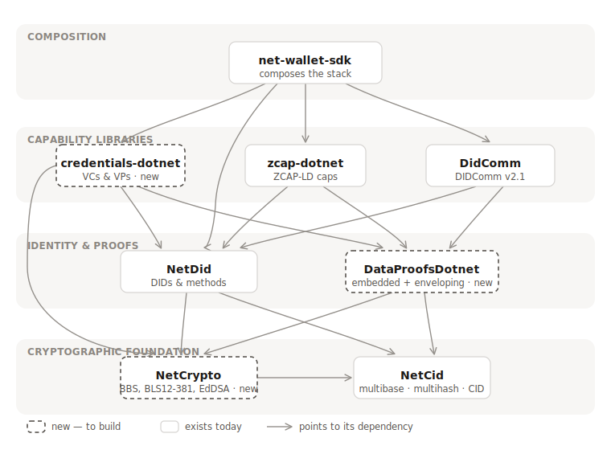

# Architectural Path

**Status:** Working draft for review
**Date:** 2026-06-05
**Scope:** The full stack behind **`net-wallet-sdk`** — a composable wallet SDK that exposes decentralized identifiers, verifiable credentials, authorization capabilities, DIDComm messaging, and payments — together with the shared foundation (`NetCid`, `NetCrypto`, `DataProofsDotnet`) that the domain libraries beneath it draw from.

> **How to read this document.** Every acronym is spelled out the first time it appears, with a sentence on why it matters. Appendix A is a full glossary if you want to jump straight to a definition. The technical recommendations are summarized in §6 and §7.

---

## 1. The problem we are solving

The goal is **`net-wallet-sdk`**: a composable wallet SDK that exposes, through one coherent surface, a full set of self-sovereign-identity capabilities — and lets a developer use any of them on their own or together. ("Self-Sovereign Identity," **SSI**, is an identity model where people and organizations hold and control their own keys and credentials, with no central authority in the middle.) The wallet brings five capabilities together:

- **Decentralized Identifiers (DIDs)** — self-controlled identifiers and their keys.
- **Verifiable credentials (VCs)** — tamper-evident, cryptographically signed claims (the digital equivalent of a diploma or licence) that a holder can present and a verifier can check.
- **Authorization capabilities** — delegatable authority: granting, narrowing, and invoking permission to act.
- **DIDComm messaging** — private, authenticated messaging between agents.
- **Payments** — moving value in stablecoins or other EVM tokens (planned; see §5.8).

**"Composable" is the operative word.** The wallet is not a black box that hides these behind one opinionated API. Each capability is delivered by a focused library that is independently usable, and the wallet *composes* them. Someone who needs only DIDs takes `NetDid`; someone who needs credentials takes `credentials-dotnet`; someone who wants the whole agent takes `net-wallet-sdk`. The SDK's value is the clean composition, not the concealment.

Delivering that cleanly requires a layered stack (§3): the wallet on top; the capability libraries beneath it (`credentials-dotnet`, `zcap-dotnet`, `DidComm`); a shared identity-and-proofs layer they all build on (`NetDid`, `DataProofsDotnet`); and — the subject of much of this document — a cryptographic **foundation** underneath everything (`NetCid`, `NetCrypto`).

The foundation exists because the domain libraries need two kinds of machinery that none of them should own alone:

1. **Cryptography** — the signing, verification, and key-agreement algorithms (including the advanced pairing crypto behind privacy-preserving credentials).
2. **Proof-format machinery** — turning a signature into a standardized, interoperable proof, whether embedded in a document or wrapping it.

Credentials, capabilities, and messaging all need both. If each library carried its own copy we would maintain the same hard cryptography several times over; if we piled it into `NetDid` we would bloat a library whose job is identifiers, not pairing-based cryptography or document canonicalization. So the machinery is extracted into a small, layered foundation (`NetCid`, `NetCrypto`, `DataProofsDotnet`) that every library draws from. This document defines that foundation, describes every subsystem and the specifications it implements (§5), and reports what already exists in the .NET ecosystem so we build only what we must (§6).

One framing note that matters for the rest of the document: **standards maturity.** The World Wide Web Consortium (W3C) and the Internet Engineering Task Force (IETF) publish specifications at different stages of stability. A W3C **Recommendation (REC)** or an IETF **RFC** is final and safe to build against. A W3C **Candidate Recommendation Draft (CRD)** or an IETF **Internet-Draft** is still changing. Wherever we have to depend on something that is not yet final, we isolate it behind an interface so the churn is contained — and as §6 shows, exactly one part of this foundation is in that situation.

---

## 2. The core idea: two ways to secure a credential

This is the key concept behind the proofs layer, so here it is in plain terms.

A Verifiable Credential is, underneath, just a structured document of claims (written in **JSON-LD** — JSON annotated with a shared vocabulary so the data has unambiguous meaning). On its own, a document of claims proves nothing. What makes it *verifiable* is a cryptographic proof binding those claims to the issuer.

The Verifiable Credentials Data Model 2.0 (VCDM 2.0 — the W3C standard that defines what a VC is) allows **two different families of proof**. Both families live in a single library, **`DataProofsDotnet`**:

- **Embedded proof.** The proof is written *inside* the credential, as a `proof` section of the same JSON document. The claims and the proof travel together as one object. This family is called **Data Integrity**.

- **Enveloping proof.** The proof is the *wrapper*: the credential becomes the payload inside a signed container, and signing the container is what secures the credential. The container formats come from the **JOSE** and **COSE** families (explained in §5).

Neither family is better; they serve different communities. Embedded proofs dominate the linked-data / decentralized-identity world and are what make advanced privacy features (described in §5) possible. Enveloping proofs dominate the OpenID and European Digital Identity wallet world. `credentials-dotnet` supports both. Keeping them in one library reflects that they are two halves of one job — securing data with a proof — and that they share the same cryptographic foundation underneath.

A one-line mental model:

> **`DataProofsDotnet` secures the data** — signing the document for an embedded proof, or signing (and where needed encrypting) the envelope for an enveloping proof. It asks `NetCrypto` to do the actual cryptography and `NetCid` to encode the results.

---

## 3. The dependency stack

*Arrows point from a subsystem to each library it depends on. Dashed borders mark libraries to build; solid borders mark libraries that already exist. The image is also provided as `dependency-stack.svg` alongside this document — keep the two files together so the diagram renders.*

**The rules the layering enforces.** It is strictly one-directional (no cycles), and every library depends only on layers at or beneath its own, with `NetCid` at the very bottom:

- Nothing in the foundation depends on a higher layer; within it, `NetCrypto` builds on `NetCid` (for key encoding), so `NetCid` is the true base of the stack.
- The identity-and-proofs layer (`NetDid`, `DataProofsDotnet`) depends only on the foundation.
- Each capability library (`credentials-dotnet`, `zcap-dotnet`, `DidComm`) depends on `NetDid` and `DataProofsDotnet`, and may also reach the foundation directly — `credentials-dotnet` depends on `NetCrypto` for the cryptographic operations it performs itself — but never on a sibling capability library.
- `net-wallet-sdk` composes the three capability libraries plus `NetDid` directly (for the DIDs capability), and is the single place where everything comes together.

---

## 4. Standards this foundation implements

For orientation, the relevant standards and their maturity:

| Standard | What it is | Maturity |
|---|---|---|
| VCDM 2.0 | Verifiable Credentials Data Model — defines a VC | W3C Recommendation (final, May 2025) |
| VC Data Integrity | Embedded-proof framework | W3C Recommendation (final) |
| EdDSA / ECDSA cryptosuites | Embedded-proof recipes using common signatures | W3C Recommendation (final) |
| VC-JOSE-COSE | How to carry a VC inside a signed envelope | W3C Recommendation (final) |
| Controlled Identifiers 1.0 | Defines verification methods (a `NetDid` concern) | W3C Recommendation (final) |
| Bitstring Status List 1.0 | Revocation/suspension of VCs | W3C Recommendation (final) |
| RDFC-1.0 | Canonicalization of linked-data documents | W3C Recommendation (final, May 2024) |
| SD-JWT | Selective disclosure for tokens | IETF RFC 9901 (final) |
| **BBS Cryptosuite (`bbs-2023`)** | Privacy-preserving selective disclosure | **W3C Candidate Recommendation Draft (not final)** |
| **BBS Signature Scheme** | The underlying algorithm BBS uses | **IETF Internet-Draft (not final)** |
| SD-JWT VC | A credential profile built on SD-JWT | IETF Internet-Draft (not final) |

The two bolded rows are the only places where we depend on something still in motion. That is the heart of the risk story in §6.

---

## 5. The subsystems, one by one

Each subsystem below lists its purpose, the specifications it implements (with version and status), and the functionality it provides. Status uses the maturity vocabulary from §4: a *Recommendation* or *RFC* is final; a *Candidate Recommendation Draft*, *Internet-Draft*, or *CCG work item* is still moving.

### 5.1 `NetCid` — exists today

**Purpose:** the encoding layer that turns keys, hashes, and identifiers into compact, self-describing strings, plus deterministic JSON canonicalization. (Name note: "CID" here is Content IDentifier, distinct from the W3C **Controlled Identifiers** standard, which is a `NetDid` concern.)

| Specification | Version | Status |
|---|---|---|
| Multiformats CID | living spec | multiformats community spec |
| Multibase | `draft-multiformats-multibase` | IETF Internet-Draft |
| Multihash | `draft-multiformats-multihash` | IETF Internet-Draft |
| Multicodec | living registry | multiformats community registry |
| JSON Canonicalization Scheme (JCS) | RFC 8785 | IETF RFC (final) |

**Functionality**

- CIDv0 and CIDv1 — parse, encode, round-trip, and version-convert.
- Multibase — base58btc, base32 (upper/lower), base36 (upper/lower), base64url.
- Multicodec — CID codecs (raw, dag-pb, dag-cbor, …) and key-type codecs (Ed25519, X25519, P-256/384/521, secp256k1, BLS12-381 G1/G2).
- Multihash — model plus SHA-256/SHA-512 helpers and spec-compliant encode/decode of any code.
- Unsigned varint codec (multiformats-compatible).
- `Multikey` — raw public key + key type → `publicKeyMultibase`.
- `JcsCanonicalizer` — RFC 8785 canonical JSON.
- Input-size limits on parsing to bound untrusted input.

**Depends on:** nothing in the stack. **Used by:** every other subsystem (`NetDid` already references the `NetCid` package). **Refactor:** none — already complete for the foundation role.

### 5.2 `NetCrypto` — new

**Purpose:** the single home for every cryptographic primitive the stack uses, behind stable interfaces so callers never bind to a specific implementation.

| Scheme | Specification | Status |
|---|---|---|
| EdDSA (Ed25519) | RFC 8032 | IETF RFC (final) |
| ECDH (X25519) | RFC 7748 | IETF RFC (final) |
| ECDSA (P-256/384/521) | FIPS 186-5 | NIST standard (final) |
| secp256k1 | SEC 2 | Certicom standard |
| BLS12-381 + hash-to-curve | RFC 9380 | IETF RFC (final) |
| BBS Signatures | `draft-irtf-cfrg-bbs-signatures-10` | IETF Internet-Draft (not final) |
| SHA-2 | FIPS 180-4 | NIST standard (final) |
| Keccak-256 (Ethereum) | Keccak (pre-FIPS) | non-standard; planned with did:ethr |
| AES-GCM | NIST SP 800-38D | NIST standard (final) |
| HKDF / HMAC | RFC 5869 / RFC 2104 | IETF RFC (final) |
| CBOR | RFC 8949 | IETF RFC (final) |

**Functionality**

- Ed25519 — sign/verify (NSec).
- X25519 — key agreement (NSec).
- secp256k1 — sign/verify (NBitcoin.Secp256k1).
- NIST P-256/P-384/P-521 — ECDSA (.NET BCL).
- BLS12-381 — curve, keygen, pairing (Nethermind.Crypto.Bls).
- BBS — keygen, sign, verify, proofGen, proofVerify; multi-message selective disclosure (zkryptium FFI).
- Keccak-256 — *planned*, arriving with `did:ethr`.
- AES-GCM, SHA-2, HKDF/HMAC, CBOR — via the .NET BCL.

**Depends on:** `NetCid` — for multibase/multicodec encoding (`MultibasePublicKey`) and the `KeyType`→multicodec map — plus external crypto (NSec, NBitcoin.Secp256k1, Nethermind.Crypto.Bls, the zkryptium FFI). **Used by:** `NetDid`, `DataProofsDotnet`.

### 5.3 `DataProofsDotnet` — new

**Purpose:** secure a document with a proof — covering both the embedded-proof (Data Integrity) and enveloping-proof (JOSE/COSE/SD-JWT) families from §2.

| Specification | Version | Status |
|---|---|---|
| VC Data Integrity | 1.0 | W3C Recommendation (2025-05-15) |
| DI EdDSA Cryptosuites (`eddsa-rdfc-2022`, `eddsa-jcs-2022`) | 1.0 | W3C Recommendation |
| DI ECDSA Cryptosuites (`ecdsa-rdfc-2019`, `ecdsa-jcs-2019`, `ecdsa-sd-2023`) | 1.0 | W3C Recommendation |
| DI BBS Cryptosuites (`bbs-2023`) | 1.0 | W3C Candidate Recommendation Draft (not final) |
| Securing VCs using JOSE & COSE (VC-JOSE-COSE) | 1.0 | W3C Recommendation |
| RDF Dataset Canonicalization (RDFC-1.0) | 1.0 | W3C Recommendation (2024-05-21) |
| JOSE — JWS/JWE/JWK/JWA/JWT | RFC 7515–7519 | IETF RFC (final) |
| COSE | RFC 9052 | IETF RFC (final) |
| CWT | RFC 8392 | IETF RFC (final) |
| SD-JWT | RFC 9901 | IETF RFC (final) |
| SD-JWT VC | `draft-ietf-oauth-sd-jwt-vc` | IETF Internet-Draft (not final) |

**Functionality**

- Embedded proofs: the Data Integrity pipeline (transform → canonicalize → hash → sign → encode), with proof sets and proof chains.
- Cryptosuites: `eddsa-rdfc-2022`, `eddsa-jcs-2022`, `ecdsa-rdfc-2019`, `ecdsa-jcs-2019`, and `bbs-2023` (selective disclosure / unlinkable). *Planned:* `ecdsa-sd-2023`.
- Canonicalization: RDFC-1.0 + JSON-LD 1.1 for the RDFC suites; JCS (via `NetCid`) for the JCS suites.
- Enveloping proofs: JWS, JWE, JWT, JWK; COSE_Sign1, CWT; SD-JWT with Key Binding JWT; the SD-JWT VC profile.
- VC-JOSE-COSE binding — carry a VCDM 2.0 payload inside a JOSE or COSE envelope.

**Depends on:** `NetCrypto`, `NetCid`. **Used by:** `credentials-dotnet`, `zcap-dotnet`, `DidComm`. **Why one library:** embedded and enveloping proofs are two halves of one concern — securing data with a proof — over a shared crypto and encoding foundation.

### 5.4 `NetDid` — exists today

**Purpose:** create, resolve, update, and deactivate Decentralized Identifiers across multiple DID methods.

| Specification | Version | Status |
|---|---|---|
| W3C Decentralized Identifiers (DID Core) | 1.0 | W3C Recommendation (2022-07-19) |
| Controlled Identifiers (verification methods) | 1.0 | W3C Recommendation (2025-05-15) |
| `did:key` | — | W3C CCG, Final |
| `did:peer` | 2.0 | DIF spec |
| `did:webvh` | 1.0 | DIF Recommended |
| `did:ethr` | — | planned (open PR) |
| DI EdDSA Cryptosuite (`eddsa-jcs-2022`) | 1.0 | W3C Recommendation (used internally for the `did:webvh` log, built on foundation primitives) |

**Functionality**

- DID methods: `did:key`; `did:peer` (numalgo 0, 2, 4); `did:webvh` (full CRUD, hash-chain log, pre-rotation, witness validation); `did:ethr` (*planned*, open PR).
- Key types: Ed25519, X25519, P-256, P-384, P-521, secp256k1, BLS12-381 G1, BLS12-381 G2.
- Resolver infrastructure: composite routing, caching, and W3C DID URL dereferencing (fragment, service, serviceType, verificationRelationship).
- DID Document model and serialization (`application/did+ld+json` and `application/did+json`).
- Pluggable key storage (`IKeyStore`), a signing abstraction (`ISigner`), and JWK conversion.
- Microsoft dependency-injection integration.

**Depends on:** `NetCid` (encoding, JCS), `NetCrypto` (signing) — and deliberately *not* `DataProofsDotnet`: the identity layer never depends on the proofs layer. **Refactor:** the raw crypto providers (NSec, NBitcoin.Secp256k1, Nethermind.Crypto.Bls) and the zkryptium BBS FFI move down to `NetCrypto`, and the private JCS copy retires in favor of `NetCid`'s. The general-purpose `eddsa-jcs-2022` cryptosuite — the one VC and ZCAP libraries use on arbitrary documents — lives in `DataProofsDotnet`. But `NetDid` keeps producing the `eddsa-jcs-2022` proof its `did:webvh` log needs by assembling it directly from foundation primitives (JCS and multibase from `NetCid`, EdDSA from `NetCrypto`); it does not import `DataProofsDotnet`. BBS leaves `NetDid` entirely — VC libraries obtain it from `NetCrypto` and `DataProofsDotnet` — so `NetDid` retains only BLS key *representation* (multikey via `NetCid`), not BBS signing.

### 5.5 `zcap-dotnet` — exists today

**Purpose:** express, delegate, and invoke authorization capabilities — authority by possession (the object-capability model) — as linked-data documents.

| Specification | Version | Status |
|---|---|---|
| Authorization Capabilities for Linked Data (ZCAP-LD) | v0.3 | W3C CCG work item (draft) |
| VC Data Integrity (securing mechanism) | 1.0 | W3C Recommendation |

**Functionality**

- Root capability creation — a structurally distinct document (no proof, no `parentCapability`).
- Delegation by chaining capability documents.
- Attenuation through caveats (restricting actions or targets; revocation hooks).
- Invocation and verification of capability chains.
- Secured with Data Integrity proofs (via `DataProofsDotnet`).

**Depends on:** `DataProofsDotnet` (proofs), `NetDid` (controller verification). **Refactor:** drops its own proof and canonicalization code in favor of `DataProofsDotnet`.

### 5.6 `DidComm` — exists today

**Purpose:** private, authenticated, asynchronous peer-to-peer messaging between DID-identified agents — the first production-grade .NET implementation of the spec.

| Specification | Version | Status |
|---|---|---|
| DIDComm Messaging | v2.1 | DIF specification (v2 ratified; v2.1 current) |
| JOSE — JWS / JWE (securing mechanism) | RFC 7515 / 7516 | IETF RFC (final) |

**Functionality**

- All three envelope types: signed (JWS), anoncrypt and authcrypt (JWE).
- Plaintext, signed, and encrypted message handling (headers and body).
- Routing (forward / mediator) and pluggable transports.
- Built-in DIDComm protocols.
- Pluggable DID resolution with built-in `did:key` / `did:peer` / `did:web` (via `NetDid`).

**Depends on:** `DataProofsDotnet` (JWS/JWE), `NetDid` (resolution). **Refactor:** uses `DataProofsDotnet` for its JOSE needs rather than its own.

### 5.7 `credentials-dotnet` — new

**Purpose:** create, issue, present, and verify Verifiable Credentials and Verifiable Presentations.

| Specification | Version | Status |
|---|---|---|
| Verifiable Credentials Data Model (VCDM) | 2.0 | W3C Recommendation (2025-05-15) |
| Bitstring Status List | 1.0 | W3C Recommendation (2025-05-15) |
| VC Data Integrity + VC-JOSE-COSE (securing) | 1.0 | W3C Recommendation |

**Functionality**

- Credential model (VCDM 2.0): issue and verify VCs.
- Presentation model: build and verify VPs with holder binding.
- Both securing families (via `DataProofsDotnet`): embedded Data Integrity (including `bbs-2023` selective disclosure) and enveloping (VC-JOSE-COSE, SD-JWT VC).
- Status: Bitstring Status List (issuer publish + verifier check) for revocation and suspension.
- Credential schema validation.

**Depends on:** `NetCrypto` (cryptographic operations it performs itself — hashing, digests, salts, holder-binding keys), `DataProofsDotnet` (proofs), `NetDid` (issuer/holder DIDs and keys).

### 5.8 `net-wallet-sdk` — composer (not a spec)

**Purpose:** the composition layer that wires the stack into one agent/wallet API. It implements no specification of its own; it exposes the capabilities of the subsystems beneath it.

**Capabilities**

- **Verifiable credentials** — issue, hold, present, and verify VCs and VPs (via `credentials-dotnet`).
- **Authorization capabilities** — create, delegate, attenuate, and invoke ZCAP-LD capabilities (via `zcap-dotnet`).
- **DIDComm messaging** — send and receive private, authenticated messages between agents (via `DidComm`).
- **DIDs** — create, resolve, and manage identifiers and keys across methods (via `NetDid`).
- **Payments** *(planned)* — send and receive value in stablecoins or any EVM (ERC-20) token. This builds on the `did:ethr` work (open PR in `NetDid`), which brings secp256k1 keys and Ethereum-address derivation; the wallet signs EVM transactions with those keys to move tokens. It introduces two concerns the stack does not have yet — EVM transaction construction and signing (secp256k1 + Keccak-256 from `NetCrypto`) and an EVM RPC/chain client — both composed at the wallet layer rather than baked into the identity libraries.

**Depends on:** all of the above.

## 6. Build vs. reuse: where to actually spend effort

Here "effort" means new code we have to write and maintain ourselves, and "risk" includes both standards still changing and the absence of an independent security review.

| Library | Reuse from the ecosystem | Build ourselves | Effort | Risk |
|---|---|---|---|---|
| `NetCid` | Already complete — multiformats, `Multikey`, full key-type codecs, and a `JcsCanonicalizer` | Nothing required for the foundation role | None | Low |
| `NetCrypto` | All primitives already wired in `NetDid` — NSec (Ed25519/X25519), NBitcoin.Secp256k1, Nethermind.Crypto.Bls (BLS12-381), and the zkryptium FFI (BBS) | Consolidate those providers; add Keccak-256 when `did:ethr` lands; verify BBS draft/cryptosuite alignment | Low–Medium — consolidation, not new crypto | Medium — pre-final BBS standards; not independently audited |
| `DataProofsDotnet` | JSON-LD + RDFC-1.0 (dotNetRDF, isolated here); JWS/JWE/COSE/SD-JWT (jose-jwt, .NET built-ins, existing libs); **`NetDid`'s eddsa-jcs-2022 as a proven starting point** | `bbs-2023` cryptosuite wiring on the existing BBS primitive; RDFC-based suites; thin enveloping glue (VC-JOSE-COSE, SD-JWT VC, CWT) | Medium — `bbs-2023` wiring is the long pole | Medium — draft churn, canonicalization edge cases |

**The one-sentence takeaway:** the hardest cryptography in the foundation — BBS — is **already implemented** as `NetDid`'s zkryptium FFI, so even that reduces to relocating working code and building the `bbs-2023` cryptosuite wiring on top of it in `DataProofsDotnet`. Everything else is assembling mature, existing libraries. The real remaining work is narrow: the `bbs-2023` cryptosuite layer, and verifying it conforms to the spec's referenced BBS draft.

### 6.1 `NetCrypto`

**Ordinary primitives — already chosen and wired.** These are not a research question: `NetDid` already uses **NSec** for Ed25519 and X25519, **NBitcoin.Secp256k1** for secp256k1, and **Nethermind.Crypto.Bls** for the BLS12-381 curve, with .NET's Base Class Library covering the NIST curves, AES-GCM, SHA-2, and key derivation. Consolidating these providers behind `NetCrypto` interfaces is low effort — it is mostly moving working code. The one primitive not yet present is **Keccak-256** for `did:ethr` (still planned); recall that .NET's built-in SHA3 is *not* Ethereum's Keccak (different padding), so a dedicated Keccak implementation will be needed when that method lands.

**BBS — already solved, now relocate it.** The hard part is done: `NetDid` already wraps the Rust library **zkryptium** (from Cybersecurity-LINKS) through a native FFI in `native/zkryptium-ffi`, exposed to C# as `IBbsCryptoProvider`. zkryptium implements BBS+ (plus blind BBS and per-verifier pseudonyms) over BLS12-381, tracking the IETF CFRG BBS draft; `NetDid` uses it for multi-message signing and selective-disclosure proofs at draft-10. So the plan is to **lift that FFI into `NetCrypto`**, not to write BBS or wrap a different library.

This retires the earlier recommendation in this document to wrap MATTR's `pairing_crypto` — there is no reason to introduce a second BBS implementation when a working, draft-aligned one already ships. (The legacy `Hyperledger.Ursa.BbsSignatures` wrapper remains unsuitable regardless: it implements the older BBS+ scheme and would not be `bbs-2023`-conformant.)

Three things to carry over and check:

1. **Native packaging is already proven.** `NetDid` already builds and ships the zkryptium native artifacts per platform, so `NetCrypto` inherits a working cross-platform FFI build (**Foreign Function Interface**, i.e. calling the Rust code from .NET) rather than starting one.
2. **Keep the `cl03` feature off.** zkryptium's CL2003 scheme pulls in GMP/MPFR through the Rug crate — a heavy native dependency with LGPL implications. The BBS path (the `bbsplus` feature) avoids it, so compile only that feature to stay Apache-2.0 and lightweight.
3. **Verify draft alignment for `bbs-2023`.** `NetDid` targets BBS draft-10; the W3C `bbs-2023` cryptosuite references a specific BBS draft version. Confirm the versions match before trusting cross-implementation proofs, and budget an independent audit — zkryptium is research-grade and not independently audited.

**Design consequence:** BBS stays behind a `NetCrypto` interface (`IBbsCryptoProvider`, lifted from `NetDid`), so draft churn is contained and the implementation is swappable. BBS-specific types must not leak upward into `DataProofsDotnet` or `credentials-dotnet`.

### 6.2 `DataProofsDotnet`

**Embedded side — canonicalization is reuse, isolated here.** **dotNetRDF** (the established .NET library for linked-data) provides *both* halves of the heaviest burden: a JSON-LD 1.1 processor and an `RdfCanonicalizer` implementing RDFC-1.0. Note it is **not used anywhere in the stack yet** — `NetDid` and `NetCid` are uniformly `System.Text.Json`, and `NetDid`'s only Data Integrity suite (`eddsa-jcs-2022`) is JCS-based and needs no RDF at all. dotNetRDF enters only when `DataProofsDotnet` implements the RDFC-based suites (including `bbs-2023`). Two things to manage:

- dotNetRDF's documentation describes its canonicalizer as conforming to a November 2023 draft; RDFC-1.0 became final in May 2024. Confirm it against the final version for a minor text-escaping difference before trusting signatures across implementations.
- dotNetRDF's JSON-LD APIs use `Newtonsoft.Json`, whereas the entire rest of the stack is `System.Text.Json`. Resolution (§7): **confine dotNetRDF and its transitive `Newtonsoft.Json` to `DataProofsDotnet`'s internals**, converting `System.Text.Json` → dotNetRDF at the canonicalization boundary so no other package inherits Newtonsoft. Also add a safeguard against a known pathological case where canonicalization of a maliciously crafted document can run very slowly.

The embedded-proof pipeline (canonicalize, hash, sign, encode) and the cryptosuite registry are new but well-specified, and partly already proven: `NetDid` already implements **eddsa-jcs-2022** (to sign its did:webvh log), which is a working reference for the general-purpose suite built here — though `NetDid` keeps its own log-signing routine on foundation primitives rather than depending on this library. The other JCS-based recipes are easy, the RDFC-based recipes are moderate, and `bbs-2023` is the long pole — but with the BBS primitive already living in `NetCrypto`, that work is the cryptosuite *wiring* (mandatory/selective JSON pointers, blank-node HMAC labeling, CBOR `proofValue`), not the cryptography.

**Enveloping side — mostly assembly.**

- **JWS / JWE / JWK — reuse `jose-jwt`**, a mature, zero-dependency, cross-platform .NET library covering the full algorithm suite (current at version 5.3.0). Microsoft's own token libraries are an alternative for the validation path.
- **COSE — reuse .NET's built-in support.** .NET has shipped COSE_Sign1 support since version 7, and CBOR support is built in; CWT is a thin addition on top.
- **SD-JWT — reuse, after checking maintenance.** An open-source .NET implementation exists (`Owf.Sd.Jwt`, from the OpenWallet Foundation labs) covering the core mechanics. Confirm its upkeep and conformance to the now-final SD-JWT standard (RFC 9901); otherwise SD-JWT is a thin build over `jose-jwt`.
- **Build (thin):** the VC-JOSE-COSE binding and the SD-JWT VC profile (the latter still an IETF draft).

The enveloping side adds no new cryptography of its own; it is the lighter half of this library, which is why the two families fit comfortably in one package.

---

## 7. Decisions

The open items are now settled:

1. **JCS lives in `NetCid`** — and it is already there. `NetCid` ships a `JcsCanonicalizer`, which `DataProofsDotnet` consumes; `NetDid`'s private JCS copy can retire.
2. **BBS lives in `NetCrypto`.** The existing zkryptium FFI (today in `NetDid`) relocates into `NetCrypto` behind `IBbsCryptoProvider`. One verification item stays open: confirming draft alignment between zkryptium (draft-10) and the `bbs-2023` cryptosuite's referenced BBS draft, plus budgeting an independent audit (zkryptium is research-grade and not independently audited).
3. **`ecdsa-sd-2023` is planned for a later release**, not v1. The cryptosuite registry is designed to accept it without rework, so the second selective-disclosure suite can be baked in when needed.
4. **The stack is `System.Text.Json`; dotNetRDF is not yet used anywhere.** When `DataProofsDotnet` needs RDF canonicalization for the RDFC-based suites, dotNetRDF and its transitive `Newtonsoft.Json` are confined to that one package's internals, with `System.Text.Json` everywhere at the API surface.
5. **`NetDid` and `NetCid` keep their names** — no rename to `did-dotnet` / `cid-dotnet`.

---

## Appendix A. Glossary

**Standards bodies and maturity**

- **W3C** — World Wide Web Consortium; publishes the Verifiable Credentials and related web standards.
- **IETF** — Internet Engineering Task Force; publishes internet standards.
- **CFRG** — Crypto Forum Research Group; the IETF's cryptographic research group, where schemes like BBS incubate.
- **RFC** — Request for Comments; a finalized IETF standard.
- **Internet-Draft** — a work-in-progress IETF document; may change or expire.
- **Recommendation (REC)** — a finalized W3C standard; safe to build against.
- **Candidate Recommendation Draft (CRD)** — a W3C draft still gathering implementation experience; not final.

**Identity concepts**

- **SSI** — Self-Sovereign Identity; an identity model where the individual controls their own credentials.
- **DID** — Decentralized Identifier; a self-controlled identifier that resolves to keys and services without a central registry. `did:ethr` is its Ethereum-based variant.
- **VC** — Verifiable Credential; a signed, tamper-evident set of claims from an issuer.
- **VCDM 2.0** — Verifiable Credentials Data Model 2.0; the W3C standard defining a VC.
- **VP** — Verifiable Presentation; a holder-assembled package of credentials shown to a verifier.
- **Controlled Identifiers** — a W3C standard defining verification methods; a `NetDid` concern. (Distinct from Content IDentifier.)
- **ZCAP-LD** — Authorization Capabilities for Linked Data; a model of delegatable authority (`zcap-dotnet`).

**Data formats and canonicalization**

- **JSON-LD** — JSON for Linked Data; JSON with a shared vocabulary so the data has unambiguous meaning. VCs are JSON-LD.
- **RDF** — Resource Description Framework; the graph model underneath JSON-LD.
- **Canonicalization** — reducing a document to one deterministic form so a signature over it is stable regardless of formatting.
- **RDFC-1.0** — RDF Dataset Canonicalization; the canonicalization algorithm for linked-data documents. (Formerly called URDNA2015.)
- **JCS** — JSON Canonicalization Scheme (RFC 8785); a simpler canonicalization for plain JSON.
- **N-Quads** — the line-based text form of RDF that canonicalization produces.
- **multibase / multicodec / multihash** — self-describing encodings (which base / which type / which hash) from the multiformats project.
- **CID (Content IDentifier)** — a multibase-wrapped multicodec and multihash; the identifier type `NetCid` is named for. (Distinct from Controlled Identifiers.)

**Proof and securing formats**

- **Data Integrity** — the W3C mechanism for embedded proofs (a proof placed inside the credential).
- **Cryptosuite** — a named recipe combining a canonicalization method, a hash, and a signature algorithm.
- **JOSE** — JSON Object Signing and Encryption; the JSON-based security format family.
- **JWS / JWE / JWT / JWK** — JSON Web Signature / Encryption / Token / Key.
- **COSE** — CBOR Object Signing and Encryption; the binary counterpart to JOSE.
- **CBOR** — Concise Binary Object Representation; a compact binary form of JSON.
- **COSE_Sign1** — a single-signer COSE signed message. **CWT** — CBOR Web Token, the CBOR analog of a JWT.
- **SD-JWT** — Selective Disclosure JWT (RFC 9901); reveals only chosen claims from a signed token.
- **KB-JWT** — Key Binding JWT; proves the holder controls the bound key, preventing replay.
- **SD-JWT VC** — the credential profile built on SD-JWT (media type `application/dc+sd-jwt`).
- **VC-JOSE-COSE** — the W3C standard for carrying a VC inside a JOSE or COSE envelope.
- **Bitstring Status List** — the W3C mechanism for revoking or suspending credentials.

**Cryptography**

- **Primitive** — a low-level algorithm (signing, hashing, or key agreement).
- **EdDSA / Ed25519** — a fast, modern signature scheme and its curve.
- **ECDSA** — Elliptic Curve Digital Signature Algorithm (the NIST curves).
- **secp256k1** — the elliptic curve used by Bitcoin and Ethereum.
- **X25519 / ECDH** — a key-agreement function / the key-agreement method it implements.
- **Keccak-256** — the hash Ethereum uses for addresses; not identical to standardized SHA3-256.
- **SHA-2 / SHA-3** — standard hash families. **HMAC / HKDF** — keyed hashing / key derivation. **AES-GCM** — authenticated symmetric encryption.
- **BBS** — a signature scheme (named for Boneh, Boyen, Shacham) that signs many claims at once and lets a holder reveal a subset, unlinkably.
- **BLS12-381** — the pairing-friendly elliptic curve BBS runs on (BLS for Barreto–Lynn–Scott).
- **Pairing-friendly curve** — an elliptic curve supporting an extra "pairing" operation that schemes like BBS require.
- **Selective disclosure** — revealing only some claims from a credential. **Unlinkability** — two presentations of the same credential cannot be correlated.

**.NET and engineering**

- **BCL** — Base Class Library; the cryptography and utilities built into .NET.
- **FFI** — Foreign Function Interface; calling a library written in another language (e.g., Rust) from .NET.
- **P/Invoke** — Platform Invoke; .NET's mechanism for FFI to native code.
- **NuGet** — .NET's package registry.
- **Audit** — an independent security review of a cryptographic implementation.
- **PRD** — Product Requirements Document.

---

## Appendix B. Sources

- W3C Verifiable Credentials 2.0 family — https://www.w3.org/news/2025/the-verifiable-credentials-2-0-family-of-specifications-is-now-a-w3c-recommendation/
- Data Integrity BBS Cryptosuites v1.0 (`bbs-2023`) — https://www.w3.org/TR/vc-di-bbs/
- BBS Signature Scheme (CFRG draft) — https://datatracker.ietf.org/doc/draft-irtf-cfrg-bbs-signatures/
- RDF Dataset Canonicalization 1.0 (final) — https://www.w3.org/TR/2024/REC-rdf-canon-20240521/
- dotNetRDF JSON-LD API — https://dotnetrdf.org/docs/latest/user_guide/jsonld/api.html
- dotNetRDF RdfCanonicalizer — https://dotnetrdf.org/docs/3.2.x/api/VDS.RDF.RdfCanonicalizer.html
- jose-jwt — https://www.nuget.org/packages/jose-jwt/
- SD-JWT for .NET (Owf.Sd.Jwt) — https://github.com/openwallet-foundation-labs/sd-jwt-dotnet
- SD-JWT VC (IETF draft) — https://datatracker.ietf.org/doc/draft-ietf-oauth-sd-jwt-vc/
- NetDid (the DID library; wraps zkryptium for BBS) — https://github.com/moisesja/net-did
- zkryptium (Rust BBS / zero-knowledge library, Cybersecurity-LINKS) — https://github.com/Cybersecurity-LINKS/zkryptium
- zkryptium on crates.io — https://crates.io/crates/zkryptium
- MATTR pairing_crypto (Rust BBS; earlier recommendation, superseded by the incumbent zkryptium FFI) — https://github.com/mattrglobal/pairing_crypto
- MATTR ffi-bbs-signatures (legacy, Ursa-based) — https://github.com/mattrglobal/ffi-bbs-signatures
- Planetarium BLS12-381 wrapper — https://www.nuget.org/packages/Planetarium.Cryptography.BLS12_381
